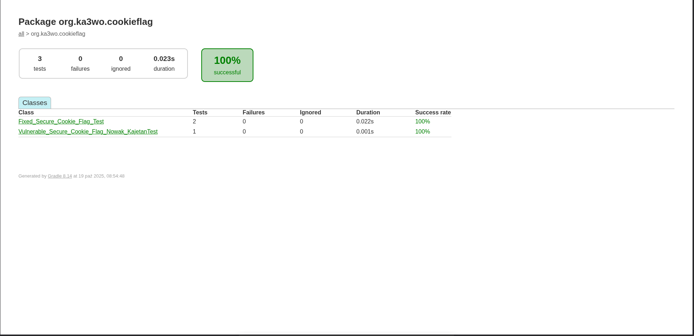
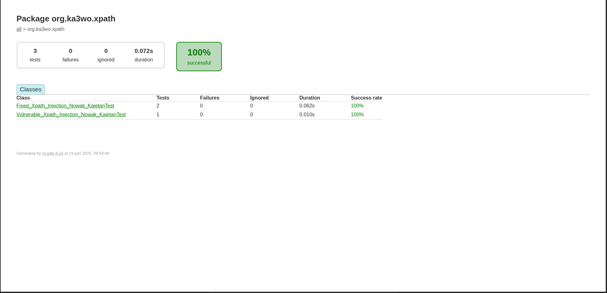

# Podatności aplikacji internetowych

## Secure Cookie Flag
Dodatkowe atrybuty w cookies:
- `Secure` - wysyłane wyłącznie przez HTTPS; zapobiega przechwyceniu przez HTTP
- `HttpOnly` - zapobiega dostępu do cookie przez JavaScript
- `SameSite` - zapobiega CSRF i przed wyciekiem informacji, gdy cookies są przesyłane w requestach między serwerami 

Klasa [Vulnerable_Secure_Cookie_Flag_Nowak_Kajetan](src/main/java/org/ka3wo/cookieflag/Vulnerable_Secure_Cookie_Flag_Nowak_Kajetan.java) 
przedstawia ustawianie id sesji w sposób niebezpieczny (możliwość ustawienia cookies przez atakującego w sposób dowolny)

Klasa [Fixed_Secure_Cookie_Flag_Nowak_Kajetan](src/main/java/org/ka3wo/cookieflag/Fixed_Secure_Cookie_Flag_Nowak_Kajetan.java)
ustawia bezpieczne id sesji domyślnie

### Testy jednostkowe dla Secure Cookie Flag

## XPath Injection

Klasa [Vulnerable_Xpath_Injection_Nowak_Kajetan](src/main/java/org/ka3wo/xpath/Vulnerable_Xpath_Injection_Nowak_Kajetan.java)
przedstawia niebezpieczne używanie zapytania dla XPath `"//user[username/text()='" + username + "']")`.
Atakujący może użyć wyrażenia `' or '1'='1`, które zwróci wszystkich użytkowników z pliku [users.xml](/src/main/resources/users.xml).

Klasa [Fixed_Xpath_Injection_Nowak_Kajetan](src/main/java/org/ka3wo/xpath/Fixed_Xpath_Injection_Nowak_Kajetan.java)
parametryzuje zapytanie XPath `"//user[username/text() = $username]"` tym samym dane są zabezpieczone przed wyciekiem.
Dodatkowo metoda [XMLUtil.loadDocument()](src/main/java/org/ka3wo/xpath/XMLUtil.java) implementuje zabezpieczenia przed XXE 
oraz niechcianym ładowaniem zewnętrznych DTD i plików.

### Testy jednostkowe dla XPath Injection
